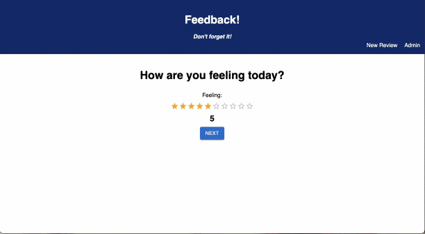
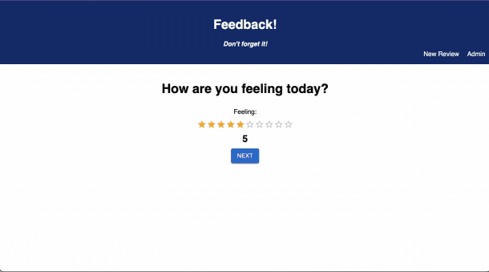

# WEEKEND-REDUX-FEEDBACK-LOOP

# Prime React Feedback Loop Project Using React Framework

## Description

_Duration: 14 Days_

This project is a solution to the Prime Digital Academy weekend challenge of the same name. The end product meets all specs for baseline and stretch goals. The code challenge instructions are found [here](./INSTRUCTIONS.md).

This project involves a full stack application to accept a multi-view feedback form. This lightweight app accomplishes that and allows users to add feedback for four categories over four forms, review the feedback, and submit to a server. This application also allows users to navigate to previous views, and make changes prior to submission. Finally, there is an 'admin' view that allows admins to review all feedback results, and delete or flag them as appropriate.

To complete this project I used the following checklist to break the problem down into steps.

Application Creation Steps

Base goal implementation

- [x] Setup and initialize redux store in seperate store file
- [x] Setup React Router functionality
- [x] Create initial component (Feeling component)
- [x] Implement view form and storage of data in store
- [x] Create and implement three additonal input form view components
- [x] Create Review view component
- [x] Create and test server then client POST routes
- [x] Create Successful feedback submission view

Stretch goal implementation

- [x] Add MUI styling to common components (Buttons)
- [x] Add MUI styling to inputs
- [x] Add PREV button functionality to navigate prior to submission
- [x] Add Admin view component
- [x] Create and test server then client GET routes
- [x] Add delet feedback functionaility
- [x] Create and test server then client DELETE routes
- [x] Add confirmation dialogue for deletions
- [x] Implement flagging logic for reviews
- [x] Create and test server then client PUT routes
- [x] Add Header component with nav bar
- [x] Deploy to Heroku

My initial strategy was to complete all functional tasks first, then go back and restyle to make it visually appealing (function over form). In reality it turned out to be a more iterative process of incremental function, then form, then more function, then more form, etc...

The single greatest challenge of this project was integrating the MUI Rating input component so that the application still passed the cypress tests. I accomplished this by creating a hidden input in each view that mirrored the functionality of the Rating input.

## Screen Shots

Base Function Screen Shot

Admin View

### Prerequisites

- [Node.js](https://nodejs.org/en/)
- [express](https://expressjs.com/)
- [React](https://react.dev/)

## Installation

1. Open up your editor of choice and run an `npm install`
2. Initiate the server using `npm run server`
3. Initiate the client using `npm run client`

## Usage

- Navigation
  - In the `Header` there is a two option navigation bar.
  - Selecting `New Review` will clear all current results and take you to a new Review Survey starting with the first question.
  - Selecting `Admin` will take you to the Admin view.
- Review Survey
  - The application will display the first feed back question. Respond by clicking the `star` that corresponds with selected rating. Numerical value will display below the star field. Click the `NEXT` button to move to the next question.
  - Continue to press the desired `star` for each response and press `NEXT` to continue to the next response or press `PREV` to return to the previouse response.
  - When you come to the comment question, type any comments into the `Enter Comments Here...` field then press `NEXT` to continue to the next response or press `PREV` to return to the previouse response.
  - When complete, you will be presented with a review of your responses. You may click `PREV` to go back and correct responses, or press `SUBMIT` to complete the survey and send the results to the server.
  - A Successful Submission view will let you know that you have successfuly submitted the survey. Here you may click the `LEAVE NEW FEEDBACK` button to start a new survey or use the Nav bar to select a new destination.
- Admin
  - The admin view displays all results currently on the server in reverse chronological order.
  - For each survey you may delete the survey from the server by clicking the `trash can delete icon` or flag it for further review bu clicking the `flag` icon.

## Built With

1. Server Side

- Node.js
- express
- postgreSQL

2. Client Side

- HTML
- CSS
- javascript
- Axios
- React
- Material UI
- sweetalert2

## Acknowledgement

Thanks to [Prime Digital Academy](www.primeacademy.io) who equipped and helped me to make this application a reality.
